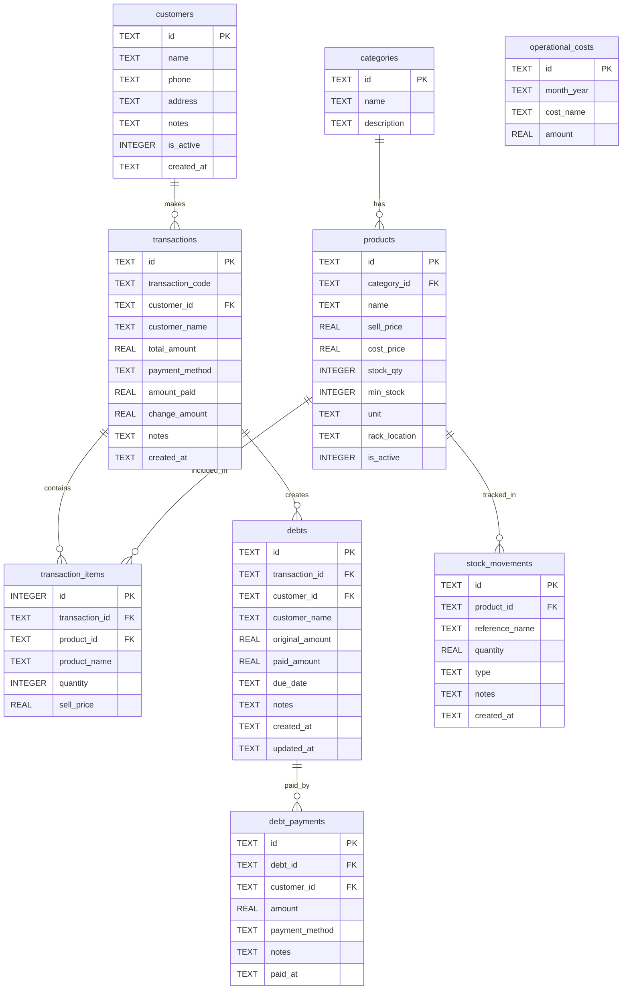

# ☕ Warung Kopi POS

Aplikasi **Point of Sale (POS)** berbasis Flutter untuk warung kopi, dirancang untuk mempermudah transaksi, manajemen stok, serta pengelolaan hutang (BON).

---

## 🚀 Fitur Utama

- Transaksi penjualan (cash, QRIS, transfer, card)
- Sistem hutang (BON)
- Manajemen produk & kategori
- Manajemen pelanggan
- Tracking stok (stock in / stock out)
- Laporan transaksi & pendapatan
- Dashboard ringkasan bisnis

---

## 🧰 Teknologi

- Flutter
- SQLite (local database)
- Dart

---

## ▶️ Menjalankan Project

```bash
flutter pub get
flutter run
```

Database akan otomatis dibuat saat pertama kali menjalankan aplikasi:

```
warung_kopi_pos.db
```

---

## 📦 Build APK

```bash
flutter build apk --debug
```

Output:

```
build/app/outputs/flutter-apk/app-debug.apk
```

---

## 📁 Struktur Folder

```
lib/
  app/        -> konfigurasi utama & routing
  features/   -> fitur utama (transaksi, produk, dll)
  shared/     -> database, model, state, widget

test/         -> testing
android/      -> konfigurasi android
```

---

## 🗄️ Database

Menggunakan SQLite dengan tabel utama:

- categories
- products
- customers
- transactions
- transaction_items
- debts
- debt_payments
- stock_movements
- operational_costs

---

## 🔗 Relasi Utama

- categories → products  
- customers → transactions  
- transactions → transaction_items  
- products → transaction_items  
- transactions → debts  
- debts → debt_payments  
- products → stock_movements  

---

## 📊 ERD (Entity Relationship Diagram)



---

## 🔄 UX Flow (User Flow POS)

### Alur Utama

```
Login → Dashboard → Pilih Produk → Keranjang → Checkout → Pembayaran → Selesai
```

---

### Transaksi Normal

1. Pilih produk  
2. Masukkan ke keranjang  
3. Checkout  
4. Pilih metode pembayaran  
5. Input jumlah bayar  
6. Transaksi selesai  
7. Cetak struk  

✔ Stok berkurang  
✔ Tidak masuk hutang  

---

### Transaksi BON (Hutang)

1. Pilih produk  
2. Checkout  
3. Pilih pelanggan (WAJIB)  
4. Pilih metode = BON  
5. Simpan transaksi  

✔ Stok berkurang  
✔ Data masuk ke `debts`  

---

### Pembayaran Hutang

1. Pilih data hutang  
2. Input pembayaran  
3. Simpan ke `debt_payments`  
4. Update status:
   - unpaid
   - partial
   - paid

---

### Dashboard & Laporan

- Pendapatan harian  
- Jumlah transaksi  
- Hutang aktif  
- Stok menipis  

---

## ⚡ Enum

**payment_method:**
- cash
- qris
- transfer
- card
- bon

**stock_movements.type:**
- stockIn
- stockOut

---

## 🛠️ Perintah Penting

```bash
flutter analyze
flutter test
flutter build apk --debug
```

---

## 📌 Catatan

- Transaksi normal langsung lunas  
- Transaksi BON akan membuat data hutang  
- Semua transaksi mempengaruhi stok & laporan  

---

## 📈 Pengembangan Selanjutnya

- Login multi user (admin / kasir)  
- Integrasi cloud database  
- Export laporan (PDF / Excel)  
- Integrasi printer thermal  